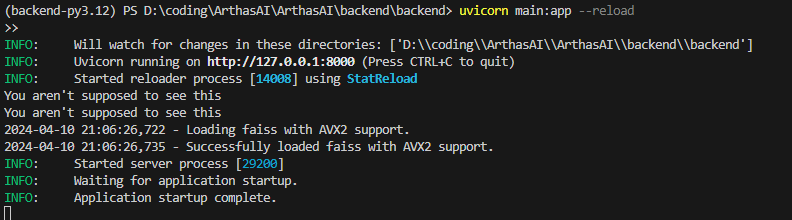

# Arthas AI

In this project we will build an AI search engine from scratch focused on efficiently searching for AI research papers (inspired by Perplexity.ai). This will be an AI first approach towards building a search engine that can more intelligently find, organize, and deliver the information that piques our curiosity.

## Tech Stack

### Frontend

- [Next.js](https://nextjs.org/)
- [ShadCN](https://ui.shadcn.com/)
- [Node.js](https://nodejs.org/en)

### Backend

- [Neo4j](https://neo4j.com/)
- [FastAPI](https://fastapi.tiangolo.com/)

## Features

Still under construction.

## Background

We have had search engines since the 1990s. However, they have not changed much in three decades.

With the growing capabilities of deep learning models we can build search engines that can provide more intelligent results–one such example which inspired this project is Perplexity.ai–these systems can also help us save time when pulling together information across many different sources. This will allow our users to waste less time when doing research and boost their productivity by providing an interface that can organize information in a more efficient manner than traditional search engines.

## Objectives

The main objectives of this project are to learn the following:

- How to design and implement an AI-native search engine from scratch.
- How to use text embeddings to find semantically similar information.
- How to build and train a deep learning model that can understand language (even if we do not actually spend the time training it we can go over how it works, they are a little expensive to actually train…).
- How to use graph databases to efficiently store relationships and knowledge graphs from AI research paper abstracts.
- How to use similarity algorithms to rank papers based on a user’s prompt input.
- We will be learning about language models and the transformer architecture (if there is a use for it possible Graph Neural Networks as well).
- How to crawl the web to get information about website links and keep this information up to date.
- How to create a backend in Python using FastAPI.

## System Designs

## How to run the local host
How to run the local host server.

This guide assumes you have the latest version of Arthas AI

Step1
Make sure you are in the right directory
cd .\ArthasAI\backend\backend\

Step2
Run Poetry Shell
(You might need to install Poetry follow this guide https://python-poetry.org/docs/ )

Step3
Run FastAPI
use command[ uvicorn main:app --reload ]to activate fastAPI
After using this command in your terminal you will receive a local host url

copy the url like http://127.0.0.1:8000

and using your favorite API platform like postman or Thunder Client

use /chat/{document_id}